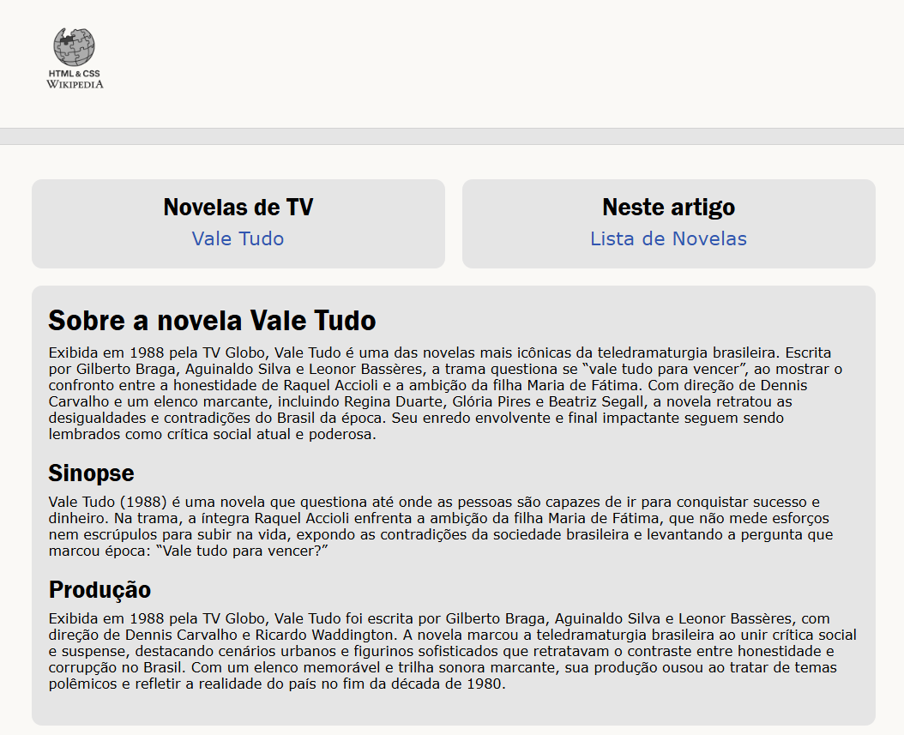

# Projeto Dio.me

## Título: 
- Recriando Wikipedia, com um layout melhor.

- Este desafio consiste em treinar você com relação à estrutura do site, e também aplicar conhecimentos adquiridos sobre semântica e acessibilidade..

## VISÃO GERAL
 - Criação de uma página web para apresentar e explicar dos conteudos assistidos e aprendidos no primeiro módulo de HTML. 
 - Neste repositório tem uma estrutura básica já pré-montada de um layout simples com um pouco de CSS aplicado. Apenas para deixar mais apresentável

